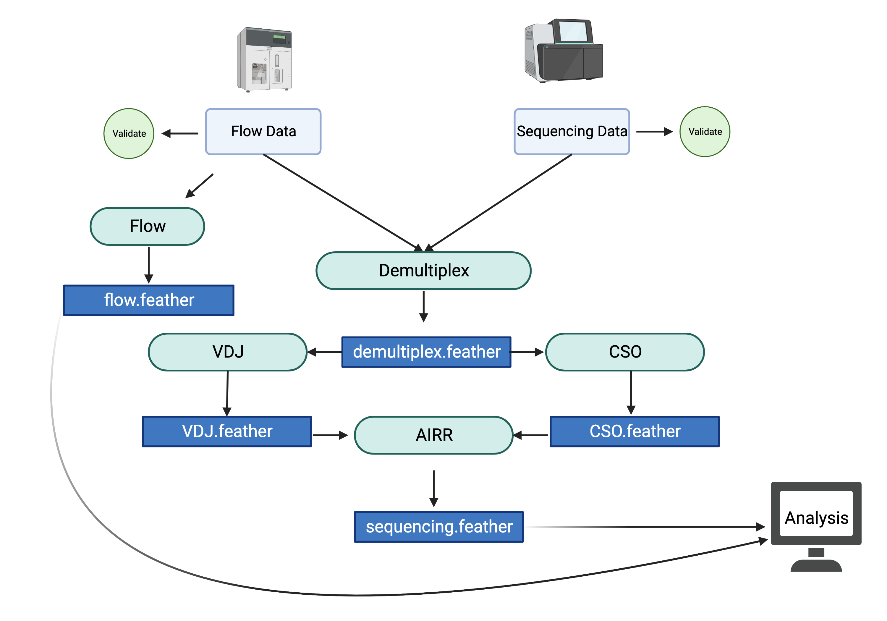

# Analysis

The analysis of the data is can be done after the pipeline.



## Getting an analysis report

The analysis report is the sequencing and flow cytometry data combined. It has all count and frequencies of the flow data and the frequencies of VRC01 class among the sequences. It will then combine those frequencies to give a final frequency of VRC01 among some cell type phenotype.

=== ":material-console-line: Command Line Usage"

    The following will produce an analysis report and combine data. It will output a flow

    <div class='termy'>
    ```bash
    $ g00x g002 analysis report -s g002/G002/output/final_df.feather -f g002/G002/output/flow_output.feather -o g002/G002/output/flow_and_sequencing
    ```
    </div>

=== " :material-api: Python"

    ```python
    from g00x.data import Data
    from g00x.analysis.report import combine_seq_and_flow

    data = Data()
    sequencing_dataframe_path = "g002/G002/output/final_df.feather"
    flow_dataframe_path = "g002/G002/output/flow_output.feather"

    # input the sequeences to feather
    sequencing_dataframe = pd.read_feather(sequencing_dataframe_path)
    flow_dataframe = pd.read_feather(flow_dataframe_path)

    # generate three different dataframe
    seq_and_flow_df, seq_and_flow_df_long_name, seq_and_flow_df_long_form = combine_seq_and_flow(
        data, sequencing_dataframe, flow_dataframe
    )
    ```

This will output a `flow_and_sequencing.feather`, `flow_and_sequencing_long_names.feather`, and `flow_and_sequencing_long_form.feather`.

The long form is the long form dataframe:

|      | run_purpose | run_date   | pubID    | ptid      | group | weeks | visit_id | probe_set | sample_type | value_type |  value | short_name                    | long_name                     | pbmc_gate_expression |
| ---: | :---------- | :--------- | :------- | :-------- | ----: | ----: | :------- | :-------- | :---------- | :--------- | -----: | :---------------------------- | :---------------------------- | :------------------- |
|  319 | PreS        | 2022-10-24 | G002-516 | G002516 |     1 |    16 | V270     | Cg28v2    | PBMC        | count      | 418948 | B cells_cell_count            | B cells_cell_count            | P4                   |
| 2326 | PreS        | 2022-10-31 | G002-884 | G002884 |     3 |    -5 | V091     | eODGT8    | PBMC        | count      |  18298 | IgG-IgA-/IgM+/KO-\_cell_count | IgG-IgA-/IgM+/KO-\_cell_count | P25                  |

The long names are pivoted:

|     | run_purpose | run_date   | pubID    | ptid      | group | weeks | visit_id | probe_set | sample_type | B cells_cell_count | CD19+/CD20-/CD27+CD38+/Antigen++/KO-\_cell_count | CD19+/CD20-/CD27+CD38+/Antigen++\_cell_count | CD19+/CD20-/CD27+CD38+/KO-/Epitope++\_cell_count | CD19+/CD20-/CD27+CD38+/KO-\_cell_count | CD19+/CD20-/CD27+CD38+\_cell_count | CD19+/CD20-\_cell_count | CD19+\_cell_count | Dump-\_cell_count | Frequency of IGD- sequences that are VRC01-class | Frequency of IGHA sequences that are VRC01-class | Frequency of IGHD sequences that are VRC01-class | Frequency of IGHG sequences that are VRC01-class | Frequency of IGHM sequences that are VRC01-class | Frequency of VRC01-class sequences among IgA | Frequency of VRC01-class sequences among IgD- | Frequency of VRC01-class sequences among IgG | Frequency of VRC01-class sequences among IgM | IgD+ B cells_cell_count | IgD+/Antigen++/KO-\_cell_count | IgD+/Antigen++\_cell_count | IgD+/KO-/Epitope++\_cell_count | IgD+/KO-\_cell_count | IgD- B cells_cell_count | IgD-/Antigen++/KO-\_cell_count | IgD-/Antigen++\_cell_count | IgD-/KO-/Epitope++\_cell_count | IgD-/KO-\_cell_count | IgG-IgA-/IgM+/Antigen++/KO-\_cell_count | IgG-IgA-/IgM+/Antigen++\_cell_count | IgG-IgA-/IgM+/KO-/Epitope++\_cell_count | IgG-IgA-/IgM+/KO-\_cell_count | IgG-IgA-/IgM+\_cell_count | IgG-IgA-\_cell_count | IgG-IgM-/IgA+/Antigen++/KO-\_cell_count | IgG-IgM-/IgA+/Antigen++\_cell_count | IgG-IgM-/IgA+/KO-/Epitope++\_cell_count | IgG-IgM-/IgA+/KO-\_cell_count | IgG-IgM-/IgA+\_cell_count | IgG-IgM-IgD-\_cell_count | IgM-IgA-/IgG+/Antigen++/KO-\_cell_count | IgM-IgA-/IgG+/Antigen++\_cell_count | IgM-IgA-/IgG+/KO-/Epitope++\_cell_count | IgM-IgA-/IgG+/KO-\_cell_count | IgM-IgA-/IgG+\_cell_count | IgM-IgA-\_cell_count | Lymphocytes_cell_count | Number of IGD- sequences that are VRC01-class | Number of IGHA sequences that are VRC01-class | Number of IGHD sequences that are VRC01-class | Number of IGHG sequences that are VRC01-class | Number of IGHM sequences that are VRC01-class | Percent IgA^{+}KO^- among Ag^{++} | Percent IgD^{-}KO^{-} among Ag^{++} | Percent IgG^{+}KO^- among Ag^{++} | Percent IgM{+}KO^- among Ag^{++} | Percent PB{+}KO^- among Ag^{++} | Percent antigen-specific among IgD^- | Percent antigen-specific among IgG^{+} | Percent antigen-specific among IgM | Percent epitope-specific (KO^-Ag^{++}) among IgA^{+} | Percent epitope-specific (KO^-Ag^{++}) among IgD^- | Percent epitope-specific (KO^-Ag^{++}) among IgG^{+} | Percent epitope-specific (KO^-Ag^{++}) among IgM | Percent epitope-specific (KO^-Ag^{++}) among PB | Percent of antigen-specific among IgA^{+} | Percent of antigen-specific among PB | Singlets_cell_count |
| --: | :---------- | :--------- | :------- | :-------- | ----: | ----: | :------- | :-------- | :---------- | -----------------: | -----------------------------------------------: | -------------------------------------------: | -----------------------------------------------: | -------------------------------------: | ---------------------------------: | ----------------------: | ----------------: | ----------------: | -----------------------------------------------: | -----------------------------------------------: | -----------------------------------------------: | -----------------------------------------------: | -----------------------------------------------: | -------------------------------------------: | --------------------------------------------: | -------------------------------------------: | -------------------------------------------: | ----------------------: | -----------------------------: | -------------------------: | -----------------------------: | -------------------: | ----------------------: | -----------------------------: | -------------------------: | -----------------------------: | -------------------: | --------------------------------------: | ----------------------------------: | --------------------------------------: | ----------------------------: | ------------------------: | -------------------: | --------------------------------------: | ----------------------------------: | --------------------------------------: | ----------------------------: | ------------------------: | -----------------------: | --------------------------------------: | ----------------------------------: | --------------------------------------: | ----------------------------: | ------------------------: | -------------------: | ---------------------: | --------------------------------------------: | --------------------------------------------: | --------------------------------------------: | --------------------------------------------: | --------------------------------------------: | --------------------------------: | ----------------------------------: | --------------------------------: | -------------------------------: | ------------------------------: | -----------------------------------: | -------------------------------------: | ---------------------------------: | ---------------------------------------------------: | -------------------------------------------------: | ---------------------------------------------------: | -----------------------------------------------: | ----------------------------------------------: | ----------------------------------------: | -----------------------------------: | ------------------: |
|  46 | PreS        | 2022-10-31 | G002-884 | G002884 |     3 |    16 | V500     | eODGT8    | PBMC        |             415845 |                                                0 |                                            5 |                                                0 |                                   1915 |                               1931 |                    4146 |            414462 |            472678 |                                              nan |                                              nan |                                              nan |                                              nan |                                              nan |                                          nan |                                           nan |                                          nan |                                          nan |                  255368 |                            117 |                        177 |                            117 |               253414 |                  161568 |                            391 |                       1504 |                            394 |               158975 |                                       3 |                                   4 |                                       3 |                         16985 |                     17142 |                25395 |                                      13 |                                  22 |                                      13 |                         38244 |                     38507 |                    46508 |                                     340 |                                1383 |                                     340 |                         92983 |                     94964 |               102932 |                 555794 |                                           nan |                                           nan |                                           nan |                                           nan |                                           nan |                           59.0909 |                             25.9973 |                           24.5842 |                        0.0176626 |                               0 |                             0.930877 |                                1.45634 |                                 75 |                                            0.0337601 |                                            0.24386 |                                              0.35803 |                                        0.0175009 |                                               0 |                                 0.0571325 |                             0.258933 |              550934 |
|   2 | PreS        | 2022-08-25 | G002-516 | G002516 |     1 |     8 | V200     | eODGT8    | PBMC        |         1.2981e+06 |                                                1 |                                            1 |                                                1 |                                  15503 |                              16641 |                  121174 |       1.27163e+06 |       1.34031e+06 |                                              nan |                                              nan |                                              nan |                                              nan |                                              nan |                                          nan |                                           nan |                                          nan |                                          nan |                  864372 |                            456 |                        718 |                            409 |               801485 |                  433730 |                            554 |                       1070 |                            469 |               404609 |                                      38 |                                  54 |                                      35 |                         69781 |                     74779 |               121496 |                                      47 |                                  97 |                                      51 |                         96230 |                    103053 |                   148151 |                                     336 |                                 709 |                                     288 |                        189984 |                    203562 |               254258 |            1.37136e+06 |                                           nan |                                           nan |                                           nan |                                           nan |                                           nan |                           48.4536 |                             51.7757 |                           47.3907 |                        0.0544561 |                             100 |                             0.246697 |                               0.348297 |                            64.8148 |                                            0.0494891 |                                           0.108132 |                                              0.14148 |                                        0.0468046 |                                      0.00600925 |                                 0.0941263 |                           0.00600925 |         1.36246e+06 |

The short names are also pivoted

|     | run_purpose | run_date   | pubID    | ptid      | group | weeks | visit_id | probe_set | sample_type | B cells_cell_count | CD19+/CD20-/CD27+CD38+/Antigen++/KO-\_cell_count | CD19+/CD20-/CD27+CD38+/Antigen++\_cell_count | CD19+/CD20-/CD27+CD38+/KO-/Epitope++\_cell_count | CD19+/CD20-/CD27+CD38+/KO-\_cell_count | CD19+/CD20-/CD27+CD38+\_cell_count | CD19+/CD20-\_cell_count | CD19+\_cell_count | Dump-\_cell_count | IgD+ B cells_cell_count | IgD+/Antigen++/KO-\_cell_count | IgD+/Antigen++\_cell_count | IgD+/KO-/Epitope++\_cell_count | IgD+/KO-\_cell_count | IgD- B cells_cell_count | IgD-/Antigen++/KO-\_cell_count | IgD-/Antigen++\_cell_count | IgD-/KO-/Epitope++\_cell_count | IgD-/KO-\_cell_count | IgG-IgA-/IgM+/Antigen++/KO-\_cell_count | IgG-IgA-/IgM+/Antigen++\_cell_count | IgG-IgA-/IgM+/KO-/Epitope++\_cell_count | IgG-IgA-/IgM+/KO-\_cell_count | IgG-IgA-/IgM+\_cell_count | IgG-IgA-\_cell_count | IgG-IgM-/IgA+/Antigen++/KO-\_cell_count | IgG-IgM-/IgA+/Antigen++\_cell_count | IgG-IgM-/IgA+/KO-/Epitope++\_cell_count | IgG-IgM-/IgA+/KO-\_cell_count | IgG-IgM-/IgA+\_cell_count | IgG-IgM-IgD-\_cell_count | IgM-IgA-/IgG+/Antigen++/KO-\_cell_count | IgM-IgA-/IgG+/Antigen++\_cell_count | IgM-IgA-/IgG+/KO-/Epitope++\_cell_count | IgM-IgA-/IgG+/KO-\_cell_count | IgM-IgA-/IgG+\_cell_count | IgM-IgA-\_cell_count | Lymphocytes_cell_count | Singlets_cell_count | num_IGHA_vrc01_class_sequences | num_IGHD_vrc01_class_sequences | num_IGHG_vrc01_class_sequences | num_IGHM_vrc01_class_sequences | num_igdneg_vrc01_class_sequences | percent_IGHA_vrc01_class_sequences | percent_IGHD_vrc01_class_sequences | percent_IGHG_vrc01_class_sequences | percent_IGHM_vrc01_class_sequences | percent_ag_among_iga | percent_ag_among_igd_neg | percent_ag_among_igg | percent_ag_among_igm | percent_ag_among_pb | percent_ep_among_iga | percent_ep_among_igd_neg | percent_ep_among_igg | percent_ep_among_igm | percent_ep_among_pb | percent_igako_among_ag | percent_igdneg_vrc01_class_sequences | percent_iggko_among_ag | percent_igmko_among_ag | percent_ko_among_ag_igd_neg | percent_pbko_among_ag | percent_vrc01_among_iga | percent_vrc01_among_igd_neg | percent_vrc01_among_igg | percent_vrc01_among_igm |
| --: | :---------- | :--------- | :------- | :-------- | ----: | ----: | :------- | :-------- | :---------- | -----------------: | -----------------------------------------------: | -------------------------------------------: | -----------------------------------------------: | -------------------------------------: | ---------------------------------: | ----------------------: | ----------------: | ----------------: | ----------------------: | -----------------------------: | -------------------------: | -----------------------------: | -------------------: | ----------------------: | -----------------------------: | -------------------------: | -----------------------------: | -------------------: | --------------------------------------: | ----------------------------------: | --------------------------------------: | ----------------------------: | ------------------------: | -------------------: | --------------------------------------: | ----------------------------------: | --------------------------------------: | ----------------------------: | ------------------------: | -----------------------: | --------------------------------------: | ----------------------------------: | --------------------------------------: | ----------------------------: | ------------------------: | -------------------: | ---------------------: | ------------------: | -----------------------------: | -----------------------------: | -----------------------------: | -----------------------------: | -------------------------------: | ---------------------------------: | ---------------------------------: | ---------------------------------: | ---------------------------------: | -------------------: | -----------------------: | -------------------: | -------------------: | ------------------: | -------------------: | -----------------------: | -------------------: | -------------------: | ------------------: | ---------------------: | -----------------------------------: | ---------------------: | ---------------------: | --------------------------: | --------------------: | ----------------------: | --------------------------: | ----------------------: | ----------------------: |
|  85 | PreS        | 2022-11-08 | G002-852 | G002852 |     1 |     8 | V200     | eODGT8    | PBMC        |             992632 |                                                3 |                                            3 |                                                3 |                                   1357 |                               1374 |                    8892 |            982808 |       1.02292e+06 |                  705541 |                            833 |                       1131 |                            833 |               698255 |                  289703 |                            930 |                       2231 |                            937 |               285912 |                                      44 |                                  57 |                                      44 |                         30308 |                     30561 |                44012 |                                      43 |                                  82 |                                      44 |                         84999 |                     85750 |                    98725 |                                     634 |                                1548 |                                     634 |                        147423 |                    149684 |               162491 |             1.0971e+06 |         1.08986e+06 |                            nan |                            nan |                            nan |                            nan |                              nan |                                nan |                                nan |                                nan |                                nan |            0.0956268 |                 0.770099 |              1.03418 |               77.193 |            0.218341 |             0.051312 |                 0.323435 |             0.423559 |             0.143974 |            0.218341 |                 52.439 |                                  nan |                40.9561 |               0.145176 |                     41.6853 |                   100 |                     nan |                         nan |                     nan |                     nan |
|  84 | PreS        | 2022-11-08 | G002-852 | G002852 |     1 |     4 | V160     | eODGT8    | PBMC        |        1.10867e+06 |                                               79 |                                          131 |                                               79 |                                   1691 |                               1782 |                   10146 |       1.09833e+06 |       1.15407e+06 |                  820575 |                           2017 |                       3147 |                           2017 |               813873 |                  290959 |                           1817 |                       3937 |                           1830 |               287026 |                                      80 |                                 145 |                                      80 |                         33509 |                     33766 |                47452 |                                      78 |                                 119 |                                      80 |                         84703 |                     85268 |                    98461 |                                     792 |                                1659 |                                     792 |                        143728 |                    145494 |               158611 |            1.23712e+06 |          1.2314e+06 |                            nan |                            nan |                            nan |                            nan |                              nan |                                nan |                                nan |                                nan |                                nan |              0.13956 |                  1.35311 |              1.14025 |              55.1724 |             7.35129 |            0.0938218 |                 0.628955 |             0.544352 |             0.236925 |             4.43322 |                65.5462 |                                  nan |                47.7396 |               0.238742 |                     46.1519 |               60.3053 |                     nan |                         nan |                     nan |                     nan |

## Count

Easily count the amount of samples we have.

=== ":material-console-line: Command Line Usage"

    <div class='termy'>
    ```bash
    $ g00x g002 analysis count -f g002/G002/output/flow_output.feather -o count
    ```
    </div>

This will output:


