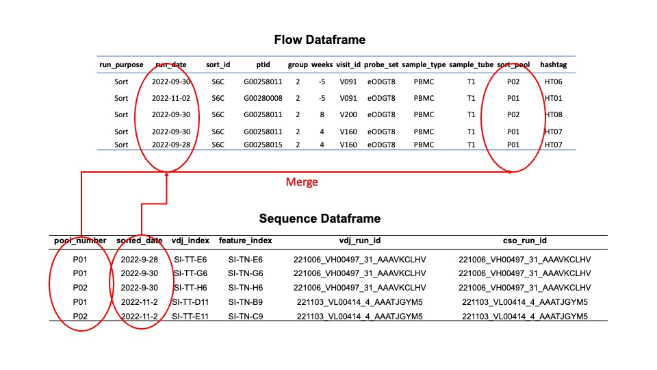

## Validation

The most important part of this clinical trial, other than its working, is that everything is validated. That means that the data is validated, the code is validated, and the results are validated. This is a crucial part of the process and should not be skipped.

### FACS/Sorting

These are instructions on validating the file structure containing the FACS/Sorting data **before** uploading to Box.

=== ":material-console-line: Command Line Usage"

 <div class="termy">
 ```bash
 #Run the validator for flow from the command line
 $ g00x g002 validate flow my_path/to/box/G002/
 ```
 </div>


 If you got your data from [AWS](g002_data.md#aws-g002), your command line would look like the following

 <div class="termy">
 ```bash
 #Run the validator for flow given the AWS structure
 $ g00x g002 validate g002/G002/sorting/G002
 ```
 </div>

=== " :material-api: Python"

 ```python
    from g00x.flow.flow import parse_flow_data
    from g00x.data import Data

    # data
 data = Data()

    # parse flow data into a dataframe
 validated_structure = parse_flow_data(data,"g002/G002/sorting/G002") # this returns a dataframe
 ```

#### File structure

Your folder structure on Box should look like this.

```bash
# If you used the above commands to sync the data. The folder structure will look like this

g002/G002/sorting
└── G002
    ├── Prescreens
    │   ├── Prescreen_RunDate220825_UploadDate221021
    │   ├── Prescreen_RunDate220826_UploadDate221021
    ....
    └── Sorts
        ├── Sort_RunDate220927_UploadDate221013
        ├── Sort_RunDate220928_UploadDate221014
        ├── Sort_RunDate220929_UploadDate221014
        ├── Sort_RunDate220930_UploadDate221014
    ...
```

#### Full file structure

[Download full architecture](https://github.com/SchiefLab/G00x/blob/main/docs/data/G002_UploadFlowFolderArchitecture.xlsx?raw=true) via Madhu Prabhakaran

### Sequencing files

To validate the sequencing files, they must be merged with the flow data. Thus, you will need both sequencing and flow files. This is because most of the metadata is housed in the flow files.

The folder for sequencing should look like the following.

```
G002
├── run0002
│   ├── 221006_VH00497_31_AAAVKCLHV
│   └── sample_manifest.csv
├── run0003
│   ├── 221019_VH00497_32_AAANGGVM5
│   └── sample_manifest.csv
└── run0004
 ├── 221101_VL00414_3_AACFYLCM5
 ├── 221103_VL00414_4_AAATJGYM5
 └── sample_manifest.csv
```

where a `sample_manifest.csv` looks like the following.

|     | pool_number | sorted_date | vdj_sequencing_replicate | cso_sequencing_replicate | vdj_lirary_replicate | cso_library_replicate | bio_replicate | vdj_index | feature_index | vdj_run_id                  | cso_run_id                  |
| --: | ----------: | ----------: | -----------------------: | -----------------------: | -------------------: | --------------------: | ------------: | :-------- | :------------ | :-------------------------- | :-------------------------- |
|   0 |           1 |      220927 |                        0 |                        0 |                    0 |                     0 |             0 | SI-TT-D6  | SI-TN-D6      | 221006_VH00497_31_AAAVKCLHV | 221006_VH00497_31_AAAVKCLHV |
|   1 |           1 |      220928 |                        0 |                        0 |                    0 |                     0 |             0 | SI-TT-E6  | SI-TN-E6      | 221006_VH00497_31_AAAVKCLHV | 221006_VH00497_31_AAAVKCLHV |
|   2 |           1 |      220929 |                        0 |                        0 |                    0 |                     0 |             0 | SI-TT-F6  | SI-TN-F6      | 221006_VH00497_31_AAAVKCLHV | 221006_VH00497_31_AAAVKCLHV |
|   3 |           1 |      220930 |                        0 |                        0 |                    0 |                     0 |             0 | SI-TT-G6  | SI-TN-G6      | 221006_VH00497_31_AAAVKCLHV | 221006_VH00497_31_AAAVKCLHV |
|   4 |           2 |      220930 |                        0 |                        0 |                    0 |                     0 |             0 | SI-TT-H6  | SI-TN-H6      | 221006_VH00497_31_AAAVKCLHV | 221006_VH00497_31_AAAVKCLHV |

---

To run the `merge` use the following.

=== ":material-console-line: Command Line Usage"

 <div class="termy">
 ```bash
 $ g00x g002 validate merge -f /path/to/flow -s /path/to/sequencing -o merge.csv
 ---> 100%

 ```
 </div>

 You can use the following command to merge the files if you have the [AWS Structure](g002_data.md#aws-g002).

 <div class='termy' >
 ``` bash
 $ g00x g002 validate merge -s ./g002/G002/sequencing/G002 -f ./g002/G002/sorting/G002 -o merge.csv
 ---> 100%

 ```
 </div>

=== " :material-api: Python"

 ```python
    from g00x.sequencing.merge import merge_flow_and_sequencing
    from g00x.data import Data

 out = 'merge.csv'
 data = Data()
 df = merge_flow_and_sequencing(data,"path/to/flow", "path/to/sequencing")
 df.to_csv(out)
 ```

The merged file will use the sort pool and sorting date as the fields to join together the sequencing and flow data.



#### Merged Fields

Below are all the fields available in the merged file. You may view the merged file through the api `my_file = merge_flow_and_sequencing(data,"path/to/flow", "path/to/sequencing")` and then `my_file.data` to view the data.

|          Column          | Definition                                                                |
| :----------------------: | :------------------------------------------------------------------------ |
|           ptid           | The participant id, e.g. G002XXXX                                         |
|          group           | The trial group, 1-4                                                      |
|          weeks           | The number of weeks post-vaccine                                          |
|         visit_id         | The visit id which corresponds to a weeks post vaccine                    |
|        probe_set         | Which probe was the sample sorted with, eOD or Core                       |
|       sample_type        | PBMC or GC                                                                |
|         run_date         | :material-merge: The date of the sort                                     |
|        sort_pool         | :material-merge: Which pool was the sample put into                       |
|         hashtag          | The hashtag oligo which will be used to demultiplex                       |
|       run_dir_path       | Where the sequencing data path is located                                 |
|       pool_number        | :material-merge: The pool number is the same as the sort pool             |
|       sorted_date        | :material-merge: The date of the sort                                     |
| vdj_sequencing_replicate | How many times has the sample been sequenced for VDJ, index starts at zero |
| cso_sequencing_replicate | How many times has the sample been sequenced for the feature library      |
|   vdj_lirary_replicate   | How many times has the same library been prepared for the VDJ             |
|  cso_library_replicate   | How many times has the same library been prepared for the feature         |
|      bio_replicate       | :material-bio: A biological replicate (brand new samples)                 |
|        vdj_index         | The Illumina index to demultiplex the VDJ library                         |
|      feature_index       | The Illumina index to demultiplex the feature library                     |
|        vdj_run_id        | The Illumina assigned run id for the VDJ library                          |
|        cso_run_id        | The Illumina assigned run id for the feature library                      |

An example of five entries for the merged file is below.

|     | ptid      | group | weeks | visit_id | probe_set | sample_type | run_date   | sort_pool | hashtag | run_dir_path                                                            | pool_number | sorted_date | vdj_sequencing_replicate | cso_sequencing_replicate | vdj_lirary_replicate | cso_library_replicate | bio_replicate | vdj_index | feature_index | vdj_run_id                  | cso_run_id                  |
| --: | :-------- | ----: | ----: | :------- | :-------- | :---------- | :--------- | :-------- | :------ | :---------------------------------------------------------------------- | :---------- | :---------- | -----------------------: | -----------------------: | -------------------: | --------------------: | ------------: | :-------- | :------------ | :-------------------------- | :-------------------------- |
|   0 | G002516 |     1 |    -5 | V091     | eODGT8    | PBMC        | 2022-09-27 | P01       | HT01    | /mnt/fsx/workspace/jwillis/repos/G00x/g002/G002/sequencing/G002/run0002 | P01         | 2022-09-27  |                        0 |                        0 |                    0 |                     0 |             0 | SI-TT-D6  | SI-TN-D6      | 221006_VH00497_31_AAAVKCLHV | 221006_VH00497_31_AAAVKCLHV |
|   1 | G002516 |     1 |     4 | V160     | eODGT8    | PBMC        | 2022-09-27 | P01       | HT02    | /mnt/fsx/workspace/jwillis/repos/G00x/g002/G002/sequencing/G002/run0002 | P01         | 2022-09-27  |                        0 |                        0 |                    0 |                     0 |             0 | SI-TT-D6  | SI-TN-D6      | 221006_VH00497_31_AAAVKCLHV | 221006_VH00497_31_AAAVKCLHV |
|   2 | G002516 |     1 |     8 | V200     | eODGT8    | PBMC        | 2022-09-27 | P01       | HT03    | /mnt/fsx/workspace/jwillis/repos/G00x/g002/G002/sequencing/G002/run0002 | P01         | 2022-09-27  |                        0 |                        0 |                    0 |                     0 |             0 | SI-TT-D6  | SI-TN-D6      | 221006_VH00497_31_AAAVKCLHV | 221006_VH00497_31_AAAVKCLHV |
|   3 | G002855 |     2 |    -5 | V091     | eODGT8    | PBMC        | 2022-09-28 | P01       | HT06    | /mnt/fsx/workspace/jwillis/repos/G00x/g002/G002/sequencing/G002/run0002 | P01         | 2022-09-28  |                        0 |                        0 |                    0 |                     0 |             0 | SI-TT-E6  | SI-TN-E6      | 221006_VH00497_31_AAAVKCLHV | 221006_VH00497_31_AAAVKCLHV |
|   4 | G002855 |     2 |     4 | V160     | eODGT8    | PBMC        | 2022-09-28 | P01       | HT07    | /mnt/fsx/workspace/jwillis/repos/G00x/g002/G002/sequencing/G002/run0002 | P01         | 2022-09-28  |                        0 |                        0 |                    0 |                     0 |             0 | SI-TT-E6  | SI-TN-E6      | 221006_VH00497_31_AAAVKCLHV | 221006_VH00497_31_AAAVKCLHV |

A downloadable merge file can be found [here](data/merge.csv)
