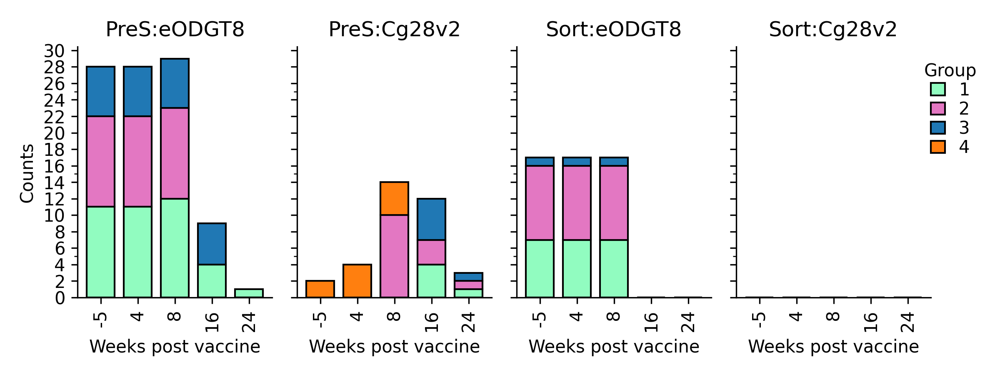

# Analysis

The analysis of the data is can be done after the pipeline.


## Getting an analysis report

The analysis report is the sequencing and flow cytometry data combined. It has all count and frequencies of the flow data and the frequencies of VRC01 class among the sequences. It will then combine those frequencies to give a final frequency of VRC01 among some cell type phenotype.

=== ":material-console-line: Command Line Usage"

    The following will produce an analysis report and combine data. It will output a flow

    <div class='termy'>
    ```bash
    $ g00x g003 analysis report -s g003/G003/output/final_df.feather -f g003/G003/output/flow_output.feather -o g003/G003/output/flow_and_sequencing
    ```
    </div>

=== " :material-api: Python"

    ```python
    from g00x.data import Data
    from g00x.analysis.report import combine_seq_and_flow

    data = Data()
    sequencing_dataframe_path = "g003/G003/output/final_df.feather"
    flow_dataframe_path = "g003/G003/output/flow_output.feather"

    # input the sequeences to feather
    sequencing_dataframe = pd.read_feather(sequencing_dataframe_path)
    flow_dataframe = pd.read_feather(flow_dataframe_path)

    # generate three different dataframe
    seq_and_flow_df, seq_and_flow_df_long_name, seq_and_flow_df_long_form = combine_seq_and_flow(
        data, sequencing_dataframe, flow_dataframe
    )
    ```

This will output a `flow_and_sequencing.feather`, `flow_and_sequencing_long_names.feather`, and `flow_and_sequencing_long_form.feather`.

The long form is the long form dataframe:

| run_purpose | pubID     | ptid         | group | weeks | visit_id | probe_set | sample_type | value_type | value     | short_name               | long_name               | pbmc_gate_expression | calculation |
|-------------|-----------|--------------|-------|-------|----------|-----------|-------------|------------|-----------|--------------------------|-------------------------|---------------------|-------------|
| KWTRPG003   | G003-243  | G003-243  | 10    | -5    | V91      | eODGT8    | PBMC        | count      | 102.0     | IgD+/KO-/Antigen++ B cells | IgD+/KO-/Antigen++ B cells | P14                 |             |
| KWTRPG003   | G003-243  | G003-243  | 10    | 8     | V201     | eODGT8    | PBMC        | count      | 2163368.0 | IgD+ B cells            | IgD+ B cells           | P6                  |             |
               |

The long names are pivoted:
|   Unnamed: 0 | run_purpose   | pubID    | ptid        |   group |   weeks | visit_id   | probe_set   | sample_type   |     B cells |       Dump- |   IgD+ B cells |   IgD+/Antigen++ B cells |   IgD+/Antigen++/KO- B cells |   IgD+/KO- B Cells |   IgD+/KO-/Antigen++ B cells |   IgD- B cells |   IgD-/Antigen++ B cells |   IgD-/Antigen++/KO- B cells |    IgD-/IgG+/KO- |   IgD-/IgG-/IgM+/Antigen++ B cells |   IgD-/IgG-/IgM+/KO-/Antigen++ B cells |   IgD-/IgM+/IgG- B cells |   IgD-/IgM-/IgG+/Antigen++ B cells |   IgD-/IgM-/IgG+/Antigen++/KO- B cells |   IgD-/KO-/Antigen++ (sorted) B cells |   IgD-IgM-IgG+ B cells |   IgD-KO- B cells |   IgG-/IgM+/KO- B cells |   IgG-/IgM+/KO-/Antigen++ B cells |   IgM-/IgG+/KO-/Antigen++ B cells |   IgM-/IgG- B cells |   IgM-/IgG-/Antigen-- B cells |   IgM-/IgG-/KO- B cells |   IgM-/IgG-/KO-/Antigen-- B cells |   IgM-IgG-/Antigen--/KO- B cells |   Lymphocytes |   Number of IGD- sequences that are VRC01-class |   Number of IGHA sequences that are VRC01-class |   Number of IGHA1*01 sequences that are VRC01-class |   Number of IGHA2*01 sequences that are VRC01-class |   Number of IGHD sequences that are VRC01-class |   Number of IGHD*02 sequences that are VRC01-class |   Number of IGHG sequences that are VRC01-class |   Number of IGHG1*01 sequences that are VRC01-class |   Number of IGHG2*01 sequences that are VRC01-class |   Number of IGHG3*01 sequences that are VRC01-class |   Number of IGHG4*01 sequences that are VRC01-class |   Number of IGHM sequences that are VRC01-class |   Number of IGHM*01 sequences that are VRC01-class |   Number of IGHV1-2*02 sequences that are VRC01-class |   Number of IGHV1-2*04 sequences that are VRC01-class |   Number of IGHV1-2*05 sequences that are VRC01-class |   Number of IGHV1-2*06 sequences that are VRC01-class |   Number of sequences |   Number of undefined-allele sequences that are VRC01-class |   Percent IgA^{+}KO^- among Ag^{--} |   Percent IgD^{-}KO^{-} among Ag^{++} |   Percent IgG^{+}KO^- among Ag^{++} |   Percent IgM{+}KO^- among Ag^{++} |   Percent antigen-specific (IgD-GT8^{++}) among IgG^{+} |   Percent antigen-specific among IgD^- |   Percent antigen-specific among IgG^{+} |   Percent antigen-specific among IgM |   Percent epitope-specific (CD4bs-specific) among IgG^{+} |   Percent epitope-specific (KO^-Ag^{++}) among IgD^- |   Percent epitope-specific (KO^-Ag^{++}) among IgG^{+} |   Percent epitope-specific (KO^-Ag^{++}) among IgM |   Percent of IGD- sequences that are VRC01-class |   Percent of IGHA sequences that are VRC01-class |   Percent of IGHA1*01 sequences that are VRC01-class |   Percent of IGHA2*01 sequences that are VRC01-class |   Percent of IGHD sequences that are VRC01-class |   Percent of IGHD*02 sequences that are VRC01-class |   Percent of IGHG sequences that are VRC01-class |   Percent of IGHG1*01 sequences that are VRC01-class |   Percent of IGHG2*01 sequences that are VRC01-class |   Percent of IGHG3*01 sequences that are VRC01-class |   Percent of IGHG4*01 sequences that are VRC01-class |   Percent of IGHM sequences that are VRC01-class |   Percent of IGHM*01 sequences that are VRC01-class |   Percent of IGHV1-2*02 sequences that are VRC01-class |   Percent of IGHV1-2*04 sequences that are VRC01-class |   Percent of IGHV1-2*05 sequences that are VRC01-class |   Percent of IGHV1-2*06 sequences that are VRC01-class |   Percent of VRC01-class sequences among IgA |   Percent of VRC01-class sequences among IgD- |   Percent of VRC01-class sequences among IgG |   Percent of VRC01-class sequences among IgM |   Percent of undefined-allele sequences that are VRC01-class |    Singlets |   num_not_vrc01_class |   num_vrc01_class |
|-------------:|:--------------|:---------|:------------|--------:|--------:|:-----------|:------------|:--------------|------------:|------------:|---------------:|-------------------------:|-----------------------------:|-------------------:|-----------------------------:|---------------:|-------------------------:|-----------------------------:|-----------------:|-----------------------------------:|---------------------------------------:|-------------------------:|-----------------------------------:|---------------------------------------:|--------------------------------------:|-----------------------:|------------------:|------------------------:|----------------------------------:|----------------------------------:|--------------------:|------------------------------:|------------------------:|----------------------------------:|---------------------------------:|--------------:|------------------------------------------------:|------------------------------------------------:|----------------------------------------------------:|----------------------------------------------------:|------------------------------------------------:|---------------------------------------------------:|------------------------------------------------:|----------------------------------------------------:|----------------------------------------------------:|----------------------------------------------------:|----------------------------------------------------:|------------------------------------------------:|---------------------------------------------------:|------------------------------------------------------:|------------------------------------------------------:|------------------------------------------------------:|------------------------------------------------------:|----------------------:|------------------------------------------------------------:|------------------------------------:|--------------------------------------:|------------------------------------:|-----------------------------------:|--------------------------------------------------------:|---------------------------------------:|-----------------------------------------:|-------------------------------------:|----------------------------------------------------------:|-----------------------------------------------------:|-------------------------------------------------------:|---------------------------------------------------:|-------------------------------------------------:|-------------------------------------------------:|-----------------------------------------------------:|-----------------------------------------------------:|-------------------------------------------------:|----------------------------------------------------:|-------------------------------------------------:|-----------------------------------------------------:|-----------------------------------------------------:|-----------------------------------------------------:|-----------------------------------------------------:|-------------------------------------------------:|----------------------------------------------------:|-------------------------------------------------------:|-------------------------------------------------------:|-------------------------------------------------------:|-------------------------------------------------------:|---------------------------------------------:|----------------------------------------------:|---------------------------------------------:|---------------------------------------------:|-------------------------------------------------------------:|------------:|----------------------:|------------------:|
|           58 | KWTRPG003     | G003-630 | G003-630 |      10 |      16 | V257       | eODGT8      | PBMC          | 2.85673e+06 | 2.92277e+06 |    1.60911e+06 |                      199 |                          165 |        1.60499e+06 |                          167 |    1.24337e+06 |                     4293 |                         1617 | 763753           |                                 13 |                                     11 |                   124732 |                               4022 |                                   1470 |                                  1599 |       767771           |       1.23859e+06 |                  124691 |                                11 |                              1471 |    328433           |                           250 |         328199          |                               112 |                              112 |   3.46313e+06 |                                              57 |                                              11 |                                                  11 |                                                   0 |                                               0 |                                                  0 |                                              45 |                                                  38 |                                                   2 |                                                   2 |                                                   3 |                                               0 |                                                  0 |                                                    57 |                                                     0 |                                                     0 |                                                     0 |                   309 |                                                           1 |                             44.8    |                               37.666  |                             36.549  |                         0.00882181 |                                                0.559151 |                               0.34527  |                                 0.523854 |                           0.0104223  |                                                  0.208265 |                                             0.128602 |                                               0.191594 |                                         0.00881891 |                                          18.4466 |                                          40.7407 |                                              40.7407 |                                                    0 |                                                0 |                                                   0 |                                          17.5781 |                                              19.0955 |                                              10.5263 |                                              8.69565 |                                                   20 |                                              0   |                                                 0   |                                                71.25   |                                                      0 |                                                      0 |                                                      0 |                                          nan |                                     0.0237226 |                                    0.0336786 |                                  0           |                                                      7.69231 | 3.26462e+06 |                   252 |                57 |
|           83 | KWTRPG003     | G003-799 | G003-799 |       6 |      21 | V292       | eODGT8      | PBMC          | 1.24465e+07 | 1.27558e+07 |    7.06433e+06 |                     1401 |                         1229 |        7.0634e+06  |                         1231 |    5.35685e+06 |                    15885 |                         9990 |      3.16765e+06 |                                 47 |                                     42 |                   531550 |                              14962 |                                   9157 |                                  9930 |            3.18366e+06 |       5.34015e+06 |                  531499 |                                42 |                              9169 |         1.63602e+06 |                           862 |              1.6356e+06 |                               710 |                              708 |   1.44308e+07 |                                             404 |                                              45 |                                                  45 |                                                   0 |                                               0 |                                                  0 |                                             358 |                                                 348 |                                                   2 |                                                   5 |                                                   3 |                                               1 |                                                  1 |                                                   404 |                                                     0 |                                                     0 |                                                     0 |                   519 |                                                           0 |                             82.1346 |                               62.8895 |                             61.2017 |                         0.00790218 |                                                0.498953 |                               0.296536 |                                 0.469962 |                           0.00884207 |                                                  0.311905 |                                             0.18537  |                                               0.288001 |                                         0.00790142 |                                          77.842  |                                          86.5385 |                                              90      |                                                    0 |                                                0 |                                                   0 |                                          78.1659 |                                              79.2711 |                                              40      |                                             50       |                                                   75 |                                             12.5 |                                                12.5 |                                                88.4026 |                                                      0 |                                                      0 |                                                      0 |                                          nan |                                     0.144296  |                                    0.225119  |                                  0.000987678 |                                                      0       | 1.40101e+07 |                   115 |               404 |


The short names are also pivoted
| run_purpose | pubID     | ptid         | group | weeks | visit_id | probe_set | sample_type | B cells   | Dump-    | IgD+ B cells | IgD+/Antigen++ B cells | IgD+/Antigen++/KO- B cells | IgD+/KO- B Cells | IgD+/KO-/Antigen++ B cells | IgD- B cells | IgD-/Antigen++ B cells | IgD-/Antigen++/KO- B cells | IgD-/IgG+/KO- | IgD-/IgG-/IgM+/Antigen++ B cells | IgD-/IgG-/IgM+/KO-/Antigen++ B cells | IgD-/IgM+/IgG- B cells | IgD-/IgM-/IgG+/Antigen++ B cells | IgD-/IgM-/IgG+/Antigen++/KO- B cells | IgD-/KO-/Antigen++ (sorted) B cells | IgD-IgM-IgG+ B cells | IgD-KO- B cells | IgG-/IgM+/KO- B cells | IgG-/IgM+/KO-/Antigen++ B cells | IgM-/IgG+/KO-/Antigen++ B cells | IgM-/IgG- B cells | IgM-/IgG-/Antigen-- B cells | IgM-/IgG-/KO- B cells | IgM-/IgG-/KO-/Antigen-- B cells | IgM-IgG-/Antigen--/KO- B cells | Lymphocytes | Singlets  | num_IGHA1*01_vrc01_class_sequences | num_IGHA2*01_vrc01_class_sequences | num_IGHA_vrc01_class_sequences | num_IGHD*02_vrc01_class_sequences | num_IGHD_vrc01_class_sequences | num_IGHG1*01_vrc01_class_sequences | num_IGHG2*01_vrc01_class_sequences | num_IGHG3*01_vrc01_class_sequences | num_IGHG4*01_vrc01_class_sequences | num_IGHG_vrc01_class_sequences | num_IGHM*01_vrc01_class_sequences | num_IGHM_vrc01_class_sequences | num_IGHV1-2*02_vrc01_class_sequences | num_IGHV1-2*04_vrc01_class_sequences | num_IGHV1-2*05_vrc01_class_sequences | num_IGHV1-2*06_vrc01_class_sequences | num_igdneg_vrc01_class_sequences | num_sequences | num_undefined-allele_vrc01_class_sequences | percent_IGHA1*01_vrc01_class_sequences | percent_IGHA2*01_vrc01_class_sequences | percent_IGHA_vrc01_class_sequences | percent_IGHD*02_vrc01_class_sequences | percent_IGHD_vrc01_class_sequences | percent_IGHG1*01_vrc01_class_sequences | percent_IGHG2*01_vrc01_class_sequences | percent_IGHG3*01_vrc01_class_sequences | percent_IGHG4*01_vrc01_class_sequences | percent_IGHG_vrc01_class_sequences | percent_IGHM*01_vrc01_class_sequences | percent_IGHM_vrc01_class_sequences | percent_IGHV1-2*02_vrc01_class_sequences | percent_IGHV1-2*04_vrc01_class_sequences | percent_IGHV1-2*05_vrc01_class_sequences | percent_IGHV1-2*06_vrc01_class_sequences | percent_ag_among_igd_neg | percent_ag_among_igg | percent_ag_among_igm | percent_cd4bs_among_igg | percent_ep_among_igd_neg | percent_ep_among_igg | percent_ep_among_igm | percent_gt8++_among_igg | percent_igako_among_ag | percent_igdneg_vrc01_class_sequences | percent_iggko_among_ag | percent_igmko_among_ag | percent_ko_among_ag_igd_neg | percent_undefined-allele_vrc01_class_sequences | percent_vrc01_among_iga | percent_vrc01_among_igd_neg | percent_vrc01_among_igg | percent_vrc01_among_igm | num_not_vrc01_class | num_vrc01_class |
|-------------|-----------|--------------|-------|-------|----------|-----------|-------------|-----------|----------|--------------|-------------------------|----------------------------|------------------|-----------------------------|-------------|------------------------|---------------------------|---------------|----------------------------------|---------------------------------------|-----------------------|------------------------------------|---------------------------------------|--------------------------------------------|--------------------|----------------|---------------------|-------------------------------|-----------------------------|-----------------|------------------------|---------------------|----------------------------|-----------------------------|-------------|-----------|----------------------------------|----------------------------------|----------------------------------|----------------------------------|----------------------------------|----------------------------------|----------------------------------|----------------------------------|----------------------------------|----------------------------------|----------------------------------|-----------------------------------------|-----------------------------------------|-----------------------------------------|-----------------------------------------|----------------------------|---------------|---------------------------------------------|-------------------------------------------|-------------------------------------------|-------------------------------------------|-------------------------------------------|-------------------------------------------|-------------------------------------------|-------------------------------------------|-------------------------------------------|-------------------------------------------|-------------------------------------------|-------------------------------------------|-----------------------------------------------|-----------------------------------------------|-----------------------------------------------|-----------------------------------------------|--------------------------|--------------------|--------------------|--------------------------|--------------------------|----------------|--------------------|--------------------------|--------------------------|-------------------------------------------|--------------------------|--------------------------|-----------------------------------|-------------------------------------------|-------------------------------------------|-------------------------------------------|-------------------------------------------|----------------------|----------------|
| KWTRPG003   | G003-630  | G003-630  | 10    | 10    | V215     | eODGT8    | PBMC        | 3494736.0 | 3547169.0 | 1717301.0    | 586.0                   | 427.0                      | 1712345.0        | 430.0                       | 1772133.0   | 7731.0                | 1924.0                   | 1019144.0     | 483.0                            | 143.0                                | 262713.0             | 6813.0                             | 1592.0                                | 1889.0                                         | 1028967.0         | 1760743.0      | 262022.0           | 143.0                        | 1599.0                      | 465573.0       | 392.0                 | 465126.0           | 123.0                          | 123.0                           | 4034868.0   | 3887505.0 | 10.0                            | 0.0                            | 10.0                           | 0.0                            | 0.0                            | 23.0                           | 1.0                            | 2.0                            | 1.0                            | 27.0                           | 0.0                            | 0.0                                  | 37.0                                  | 0.0                                  | 0.0                                  | 37.0                       | 305.0         | 0.0                                       | 23.25581395348837                       | 0.0                                       | 22.22222222222222                       | 0.0                                       | 0.0                                       | 11.330049261083744                       | 5.555555555555555                        | 11.11111111111111                       | 10.0                                      | 10.843373493975903                       | 0.0                                       | 0.0                                       | 60.65573770491803                           | 0.0                                       | 0.0                                       | 0.0                                       | 0.43625393805092505 | 0.6621203595450583 | 0.1838508181932375 | 0.18358217513292457 | 0.10659470818499515 | 0.1553985696334285 | 0.05443202277770799 | 0.751336048677946 | 31.377551020408163 | 12.131147540983607 | 23.367092323499193                       | 0.05457556999030616 | 24.886819298926397 | 0.0                               |                               | 0.01293116132080269                        | 0.016850447309648874 | 0.0                               | 268.0                | 37.0           |
| KWTRPG003   | G003-799  | G003-799  | 6     | 21    | V292     | eODGT8    | PBMC        | 12446531.0| 12755837.0| 7064332.0    | 1401.0                  | 1229.0                     | 7063404.0        | 1231.0                      | 5356848.0   | 15885.0               | 9990.0                   | 3167650.0     | 47.0                             | 42.0                                 | 531550.0             | 14962.0                            | 9157.0                                | 9930.0                                         | 3183665.0         | 5340149.0      | 531499.0           | 42.0                        | 9169.0                      | 1636022.0      | 862.0                 | 1635598.0          | 710.0                          | 708.0                           | 14430849.0  | 14010068.0 | 45.0                            | 0.0                            | 45.0                           | 0.0                            | 0.0                            | 348.0                          | 2.0                            | 5.0                            | 3.0                            | 358.0                          | 1.0                            | 1.0                                  | 404.0                                  | 0.0                                  | 0.0                                  | 0.0                        | 404.0         | 519.0                                     | 90.0                                   | 0.0                                       | 86.53846153846155                       | 0.0                                       | 0.0                                       | 79.27107061503416                       | 40.0                                | 50.0                               | 75.0                                      | 78.16593886462883                       | 12.5                                      | 12.5                                      | 88.40262582056893                          | 0.0                                       | 0.0                                       | 0.0                                       | 0.2965363213591276  | 0.469961506628367  | 0.00884206565704073 | 0.3119046759002596  | 0.18537020277596078 | 0.28800140718323064 | 0.007901420374376822 | 0.4989532504205059 | 82.13457076566125 | 77.84200385356455 | 61.20171100120305                       | 0.007902178555368872 | 62.889518413597735 | 0.0                               |                               | 0.1442958803882238                        | 0.2251190038681148 | 0.0009876775467971028           | 115.0               | 404.0          |

## Count

Easily count the amount of samples we have.

=== ":material-console-line: Command Line Usage"

    <div class='termy'>
    ```bash
    $ g00x g003 analysis count -f g003/G003/output/flow_output.feather -o count
    ```
    </div>

This will output:



