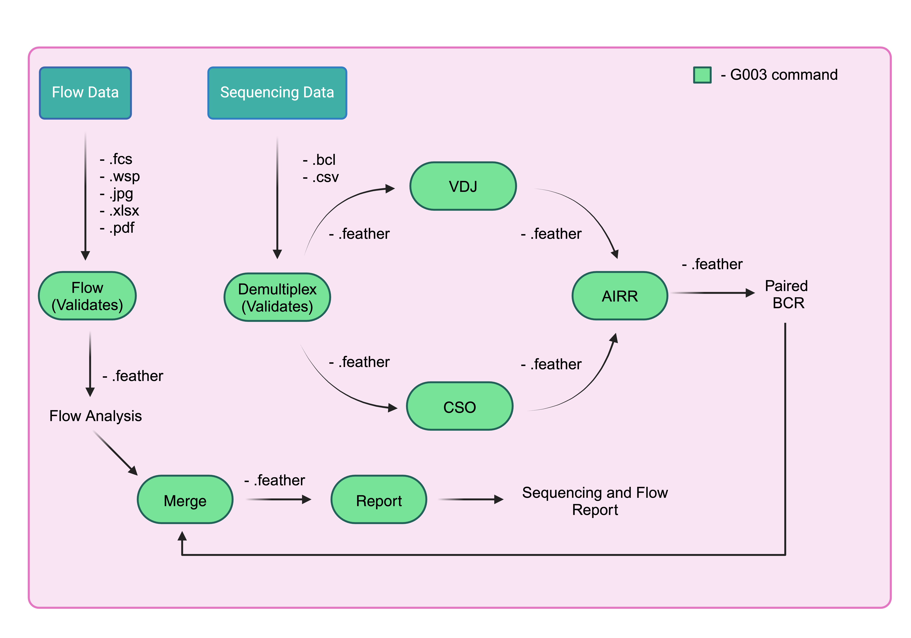

# 10x pipeline

After you have a validated merged dataframe in from [validation](g003_validation.md), you can begin the 10X pipeline which consists of demultiplexing, vdj, and feature counting.



!!! warning "CellRanger 7.1.0"

    The cellranger version in this pipeline is 7.1.0

## Flow

=== ":material-console-line: Command Line Usage"

    The following will analyze the flow path and output a dataframe that will be used in analysis. It computes each count of each gate that are useful in frequency analysis.

    <div class="termy">
    ```bash
    $ g00x g003 pipeline flow -o g003/G003/output/flow /path/to/flow
    ```
    </div>

=== " :material-api: Python"

    ```python
    import pandas as pd
    from g00x.data import Data
    from g00x.flow.flow import parse_flow_data
    from pathlib import Path

    data = ctx.obj["data"]
    folder = 'path/to/flow'
    flow_data = parse_flow_data(data, folder)
    out = Path(out)
    output_feather = Path(out.parent / (out.stem + ".feather"))
    output_csv = Path(out.parent / (out.stem + ".csv"))
    ```

Here is what the flow dataframe will look like.

|      | run_purpose | run_date   | sort_id | ptid      | group | weeks | visit_id | probe_set | sample_type | sort_software_dv | sort_file_type | sample_tube | gate | phenotype          | value_type | extention | file_path                                                                                                                                                                                 | file_subset |  value | branch | easy_name                       | notes | sort_pool | hashtag |
| ---: | :---------- | :--------- | :------ | :-------- | ----: | ----: | :------- | :-------- | :---------- | :--------------- | :------------- | :---------- | :--- | :----------------- | :--------- | :-------- | :---------------------------------------------------------------------------------------------------------------------------------------------------------------------------------------- | :---------- | -----: | :----- | :------------------------------ | ----: | :-------- | :------ |
|  119 | PreS        | 2022-08-25 | S6C     | G003831 |     2 |    -5 | V091     | eODGT8    | PBMC        | DV               | Summary        | T1          | P11  | IgD+/Antigen++     | count      | .csv      | ['g003/G003/sorting/G003/Prescreens/Prescreen_RunDate220825_UploadDate221021/PopulationSummaryFilesFromDV/PreS_220825_S6C_G003831_V091_eODGT8_PBMC_DV_Summary_T1_a.csv']                | ['a']       |     50 | IgD+   | antigen_pos_igd_pos_b_cells     |   nan |           |         |
| 2461 | PreS        | 2022-11-04 | S6C     | G003136 |     2 |     8 | V200     | eODGT8    | PBMC        | DV               | Summary        | T1          | P13  | IgD+/KO-           | count      | .csv      | ['g003/G003/sorting/G003/Prescreens/Prescreen_RunDate221104_UploadDate221129/PopulationSummaryFilesFromDV/PreS_221104_S6C_G003136_V200_eODGT8_PBMC_DV_Summary_T1_a.csv']                | ['a']       | 190682 | IgD+   |                                 |   nan |           |         |
| 2754 | PreS        | 2022-11-04 | S6C     | G003947 |     2 |     8 | V200     | Cg28v2    | PBMC        | DV               | Summary        | T1          | P31  | IgG-IgM-/IgA+/KO-  | count      | .csv      | ['g003/G003/sorting/G003/Prescreens/Prescreen_RunDate221104_UploadDate221129/PopulationSummaryFilesFromDV/PreS_221104_S6C_G003947_V200_Cg28v2_PBMC_DV_Summary_T1_a.csv']                | ['a']       |  10498 | IgA+   |                                 |   nan |           |         |
| 4485 | Sort        | 2022-10-25 | S6C     | G003831 |     2 |     4 | V160     | eODGT8    | PBMC        | DV               | Summary        | T1          | P27  | IgG-IgM-IgD-       | count      | .csv      | ['g003/G003/sorting/G003/Sorts/Sort_RunDate221025_UploadDate221101/ClinicalSamples/PopulationSummaryFilesFromDV/Sort_221025_S6C_G003831_V160_eODGT8_PBMC_HT02_DV_Summary_T1_P03_a.csv'] | ['a']       | 100696 |        |                                 |   nan | P03       | HT02    |
| 2343 | PreS        | 2022-11-04 | S6C     | G003136 |     2 |    -5 | V091     | eODGT8    | PBMC        | DV               | Summary        | T1          | P12  | IgD+/Antigen++/KO- | count      | .csv      | ['g003/G003/sorting/G003/Prescreens/Prescreen_RunDate221104_UploadDate221129/PopulationSummaryFilesFromDV/PreS_221104_S6C_G003136_V091_eODGT8_PBMC_DV_Summary_T1_a.csv']                | ['a']       |     47 | IgD+   | epitope_pos_igd_pos_b_cells_rev |   nan |           |         |

## Demultiplexing

The input to the demultiplexing part of the pipeline will be the sequencing and flow file paths

=== ":material-console-line: Command Line Usage"

    <div class="termy">
    ```bash
    $ g00x g003 pipeline demultiplex -o g003/G003/output/demultiplex -f /path/to/flow -s /path/to/sequencing
    ```
    </div>

=== " :material-api: Python"

    ```python
    import pandas as pd
    from g00x.data import Data
    from g00x.sequencing.tenX import run_demultiplex

    flow_path = "path/to/flow"
    sequencing_path = "path/to/sequencing"
    data = Data()
    merged_dataframe: pd.DataFrame = merge_flow_and_sequencing(data, flow_path, sequencing_path)  # type: ignore
    demultiplex_df = run_demultiplex(data, merged_dataframe, out, overwrite)
    demultiplex_df.to_csv("demultiplex.csv")
    demultiplex_df.to_csv("demultiplex.feather")
    ```

The demulitplex algorithm will add the following fields in demultiplex output

|     Column      | Definition                                                          |
| :-------------: | :------------------------------------------------------------------ |
|   vdj_run_dir   | The full path to the vdj run directory, e.g. the Illumina directory |
|   cso_run_dir   | The full path to the cso run directory, e.g. the Illumina directory |
| vdj_sample_name | The unique vdj sample name given to each row                        |
| cso_sample_name | The unique cso sample name given to each row                        |
|  vdj_fastq_dir  | The full path to the vdj fastq directory                            |
|  cso_fastq_dir  | The full path to the cso fastq directory                            |

An example demultiplexing output dataframe is found below.

|     | ptid      | group | weeks | visit_id | probe_set | sample_type | run_date   | sort_pool | hashtag | run_dir_path                                                            | pool_number | sorted_date | vdj_sequencing_replicate | cso_sequencing_replicate | vdj_lirary_replicate | cso_library_replicate | bio_replicate | vdj_index | feature_index | vdj_run_id                  | cso_run_id                  | vdj_run_dir_path                                                                                    | cso_run_dir_path                                                                                    | vdj_fastq_dir                                                                                                                                            | vdj_sample_name | cso_fastq_dir                                                                                                                                            | cso_sample_name |
| --: | :-------- | ----: | ----: | :------- | :-------- | :---------- | :--------- | :-------- | :------ | :---------------------------------------------------------------------- | :---------- | :---------- | -----------------------: | -----------------------: | -------------------: | --------------------: | ------------: | :-------- | :------------ | :-------------------------- | :-------------------------- | :-------------------------------------------------------------------------------------------------- | :-------------------------------------------------------------------------------------------------- | :------------------------------------------------------------------------------------------------------------------------------------------------------- | :-------------- | :------------------------------------------------------------------------------------------------------------------------------------------------------- | :-------------- |
|   0 | G003516 |     1 |    -5 | V091     | eODGT8    | PBMC        | 2022-09-27 | P01       | HT01    | /mnt/fsx/workspace/jwillis/repos/G00x/g003/G003/sequencing/G003/run0002 | P01         | 2022-09-27  |                        0 |                        0 |                    0 |                     0 |             0 | SI-TT-D6  | SI-TN-D6      | 221006_VH00497_31_AAAVKCLHV | 221006_VH00497_31_AAAVKCLHV | /mnt/fsx/workspace/jwillis/repos/G00x/g003/G003/sequencing/G003/run0002/221006_VH00497_31_AAAVKCLHV | /mnt/fsx/workspace/jwillis/repos/G00x/g003/G003/sequencing/G003/run0002/221006_VH00497_31_AAAVKCLHV | /mnt/fsx/workspace/jwillis/repos/G00x/g003/G003/sequencing/G003/run0002/working_directory/demultiplexed/29cc0e71cb9200226957921707138c5c/outs/fastq_path | vdj-SI-TT-D6    | /mnt/fsx/workspace/jwillis/repos/G00x/g003/G003/sequencing/G003/run0002/working_directory/demultiplexed/29cc0e71cb9200226957921707138c5c/outs/fastq_path | cso-SI-TN-D6    |
|   1 | G003516 |     1 |     4 | V160     | eODGT8    | PBMC        | 2022-09-27 | P01       | HT02    | /mnt/fsx/workspace/jwillis/repos/G00x/g003/G003/sequencing/G003/run0002 | P01         | 2022-09-27  |                        0 |                        0 |                    0 |                     0 |             0 | SI-TT-D6  | SI-TN-D6      | 221006_VH00497_31_AAAVKCLHV | 221006_VH00497_31_AAAVKCLHV | /mnt/fsx/workspace/jwillis/repos/G00x/g003/G003/sequencing/G003/run0002/221006_VH00497_31_AAAVKCLHV | /mnt/fsx/workspace/jwillis/repos/G00x/g003/G003/sequencing/G003/run0002/221006_VH00497_31_AAAVKCLHV | /mnt/fsx/workspace/jwillis/repos/G00x/g003/G003/sequencing/G003/run0002/working_directory/demultiplexed/29cc0e71cb9200226957921707138c5c/outs/fastq_path | vdj-SI-TT-D6    | /mnt/fsx/workspace/jwillis/repos/G00x/g003/G003/sequencing/G003/run0002/working_directory/demultiplexed/29cc0e71cb9200226957921707138c5c/outs/fastq_path | cso-SI-TN-D6    |

## VDJ

The output of demultiplexing pipeline will be used as input, see the [pipeline](#10x-pipeline)

=== ":material-console-line: Command Line Usage"

    The following will run the VDJ pipeline from the demultiplex dataframe and output vdj.feather inside of the output folder.

    <div class="termy">
    ```bash
    Run it from demultiplexed dataframe
    $ g00x g003 pipeline vdj -o g003/G003/output/vdj -d output/demultiplexed.feather
    ```
    </div>

=== " :material-api: Python"

    You can run the same with the following python code.

    ```python
    from g00x.sequencing.tenX import run_vdj
    from g00x.data import Data

    data = Data()
    demultiplex_dataframe = pd.read_feather(demultiplex_dataframe_path)
    run_vdj(data, demultiplex_dataframe, out)
    ```

The output vdj dataframe will only contain one additional field

|   Column   | Definition                             |
| :--------: | :------------------------------------- |
| vdj_output | The full path to the vdj output folder |

## CSO

This CSO pipeline will run the cellranger count part and output a feature matrix. It also uses the demultiplex.feather as input.

=== ":material-console-line: Command Line Usage"

    The following will run the CSO pipeline from the demultiplex dataframe and output cso.feather inside of the output folder.

    <div class="termy">
    ```bash
    Run it from demultiplexed dataframe
    $ g00x g003 pipeline cso -o g003/G003/output/cso -d output/demultiplexed.feather
    ```
    </div>

=== " :material-api: Python"

    You can run the same with the following python code.

    ```python
    from g00x.sequencing.tenX import run_cso
    from g00x.data import Data

    data = Data()
    demultiplex_dataframe = pd.read_feather(demultiplex_dataframe_path)
    run_cso(data, demultiplex_dataframe, out)
    ```

The output cso dataframe will only contain one additional field

|   Column   | Definition                             |
| :--------: | :------------------------------------- |
| cso_output | The full path to the cso output folder |

## AIRR

The output of the VDJ and CSO can now be combined to get a final sequencing dataframe. This is the final sequencing dataframe that will be used for the analysis.

The AIRR protocol does the following.

It will...

1. Run SADIE AIRR on the VDJ contigs to get a formalized AIRR dataframe.
2. Analyze the feature barcodes and assign cellids to the correct participant.
3. Add the PubIDs to the AIRR dataframe.
4. Run mutational analysis
5. Run iGL assignment to all sequences
6. Determine if sequence is VRC01 class
7. Add mutational sets (find what mutations are VRC01-like)
8. Cluster sequences
9. Determine isotype

=== ":material-console-line: Command Line Usage"

    The following will run the AIRR pipeline from the VDJ and CSO dataframes and output airr.feather inside of the output folder.

    <div class="termy">
    ```bash
    Run it from VDJ and CSO dataframes
    $ g00x g003 pipeline airr -o g003/G003/output/airr -v output/vdj.feather -c output/cso.feather
    ```
    </div>

=== " :material-api: Python"

    You can run the same with the following python code.

    ```python
    from g00x.data import Data
    from g00x.sequencing.airr import run_airr

    vdj_out = 'output/vdj.feather'
    cso_out = 'output/cso.feather'
    data = Data()
    vdj_dataframe = pd.read_feather(vdj_out)
    cso_dataframe = pd.read_feather(cso_out)
    output_df = run_airr(data, vdj_dataframe, cso_dataframe, out, overwrite)
    ```

An output dataframe will take the following:

|       | cellid                                     | pubID    | ptid      | group | weeks | visit_id | probe_set | sample_type | run_date   | sort_pool | hashtag | run_dir_path                                                            | pool_number | sorted_date | vdj_sequencing_replicate | cso_sequencing_replicate | vdj_lirary_replicate | cso_library_replicate | bio_replicate | vdj_index | feature_index | vdj_run_id                  | cso_run_id                  | vdj_run_dir_path                                                                                    | cso_run_dir_path                                                                                    | vdj_fastq_dir                                                                                                                                            | vdj_sample_name | cso_fastq_dir                                                                                                                                            | cso_sample_name | vdj_output                                                                                                    | cso_output                                                                                                    | sadie_airr_path                                                                                                                       | paired_sadie_airr_path                                                                                                                       | cellhash           | sequence_id_heavy           | sequence_heavy                                                                                                                                                                                                                                                                                                                                                                                                                                                                                                                                                                                                                                                                                       | reference_name_heavy | locus_heavy | stop_codon_heavy | vj_in_frame_heavy | v_frameshift_heavy | productive_heavy | rev_comp_heavy | complete_vdj_heavy | v_call_top_heavy | v_call_heavy | d_call_top_heavy | d_call_heavy | j_call_top_heavy | j_call_heavy | c_call_heavy | sequence_alignment_heavy                                                                                                                                                                                                                                                                                                                                                  | germline_alignment_heavy                                                                                                                                                                                                                                                                                                                                                  | sequence_alignment_aa_heavy                                                                                              | germline_alignment_aa_heavy                                                                                              | v_alignment_start_heavy | v_alignment_end_heavy | d_alignment_start_heavy | d_alignment_end_heavy | j_alignment_start_heavy | j_alignment_end_heavy | c_alignment_start_heavy | c_alignment_end_heavy | v_sequence_alignment_heavy                                                                                                                                                                                                                                                                               | v_sequence_alignment_aa_heavy                                                                      | v_germline_alignment_heavy                                                                                                                                                                                                                                                                               | v_germline_alignment_aa_heavy                                                                      | d_sequence_alignment_heavy | d_sequence_alignment_aa_heavy | d_germline_alignment_heavy | d_germline_alignment_
