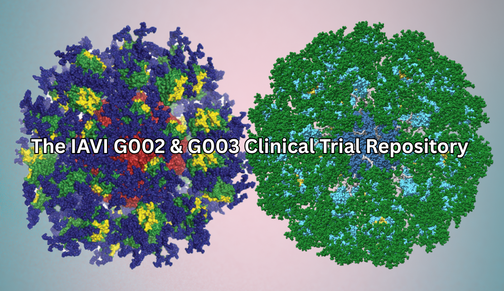

<div align="center">

</div>
<h1 align="center">
  <br>
  G00x - Generalizable Germline-Targeting Clinical Trial Pipeline
</h1>

<div class="flex-container" align="center">
    <a href="https://img.shields.io/badge/Python-3.10-blue">
    
    <a href="https://github.com/psf/black">
    
    <a href="https://github.com/pre-commit/pre-commit">
    
    <a href="https://doi.org/10.5281/zenodo.15284778">
    </a>
    <a href="https://app.netlify.com/projects/g00x/deploys">
    </a>
</div>

## About

This is the code for the G00x pipelines including G002 and G003. It is an all-in-one pipeline and analysis that parses, validates, calculates frequencies, runs 10X and combines all analysis into a plottable dataframe.

---

<!-- use a href so you can use _blank to open new tab -->

**Source Code**: <a href="https://github.com/schieflab/G002-and-G003" target="_blank">https://github.com/schieflab/G002-and-G003</a>

---

## Quick start installation

While not necessary, we highly recommend using the [conda](https://docs.conda.io/en/latest/) open-source package and environment manager. This allows you to make an environment without destroying your system installed python environment.

<ins>Miniconda installers</ins>

[Mac command line installer](https://repo.anaconda.com/miniconda/Miniconda3-latest-MacOSX-x86_64.sh)

[Mac GUI installer](https://repo.anaconda.com/miniconda/Miniconda3-latest-MacOSX-x86_64.pkg)

[Linux command line installer](https://repo.anaconda.com/miniconda/Miniconda3-latest-Linux-x86_64.sh)

To install G00x package, use the following

<div class="termy">

```console
clone the repository
$ git clone https://github.com/schieflab/G002-and-G003

change into G002-and-G003
$ cd G002-and-G003

create an environment
$ conda create -n g00x python==3.10.6 poetry==1.3.1 -y

activate the environment
$ conda activate g00x


use poetry to install
$ poetry install --with dev

$ g00x --help
Usage: g00x [OPTIONS] COMMAND [ARGS]...

Options:
  --logging-level TEXT  Set logging level
  --help                Show this message and exit.

Commands:
  g002  Run the G002 commands of G00x
  g003  Run the G003 commands of G00x

run g002 part of g00x
$ g00x g002 --help

Usage: g00x g002 [OPTIONS] COMMAND [ARGS]...

  Run the G002 commands of G00x

Options:
  --help  Show this message and exit.

Commands:
  analysis  Commands that will analyze the complete pipeline
  box       Commands that will interact with NIHBox
  globus    Commands that will interact with Globus
  pipeline  Run the 10x pipeline including the SADIE AIRR output
  validate  Commands that will validate the file have all appropriate...
```

</div>

## Installation Guide: Cell Ranger 7.0 and bcl2fastq
G00x requires `cellranger 7.0.1` to be installed from the 10x website. Please check that you system needs to meet the [system requirements](https://www.10xgenomics.com/support/software/cell-ranger/downloads/cr-system-requirements). The installation instructions for cel are on the [10x website](https://www.10xgenomics.com/support/software/cell-ranger/downloads#download-links), then to add the cellranger binary to your path. 

---

### 1. Install Cell Ranger 7.0.1

1. Download and Extract

```bash
cd ~/apps  # Or any directory in your PATH
wget link to cellranger-7.0.1.tar.gz on 10x website
tar -xzvf cellranger-7.0.1.tar.gz
```

2.  Add to PATH

Edit your shell config file (`~/.bashrc`, `~/.zshrc`, etc.):

```bash
export PATH=/apps/cellranger:$PATH
```

Then reload:

```bash
source ~/.bashrc
# or
source ~/.zshrc
```

3. Confirm Installation

```bash
cellranger --version
# Should return something like: cellranger 7.0.1
```

---

###  2. Install bcl2fastq

1. Download from Illumina (login required):  
   [Illumina bcl2fastq Download](https://support.illumina.com/sequencing/sequencing_software/bcl2fastq-conversion-software/downloads.html)

2. Install:

```bash
tar -xvzf bcl2fastq2-2.20.0.422-Linux-x86_64.zip
cd bcl2fastq2-2.20.0.422
./install
```

3. Add to PATH:

```bash
export PATH=/usr/local/bcl2fastq/bin:$PATH
```

4. Confirm Installation

```bash
bcl2fastq --version
# Should return version info like: bcl2fastq v2.20.0.422
```

After installation, both tools can be used in your G00x pipeline. The Pipeline will detect them in the path, but you can also specify the path to the tools when running the pipeline

---

## G002 where to go

📊 [**G002 Data**](g002_data.md)
Transfer and use the raw data ➡️ [Take me!](g002_data.md)

---

✅ [**G002 Validation**](g002_validation.md)
Validate your data structures ➡️ [Take me!](g002_validation.md)

---

🧪 [**G002 Pipeline**](g002_pipeline.md)
Use the G002 flow and sequencing pipeline ➡️ [Take me!](g002_pipeline.md)

---

🔍 [**G002 Analysis**](g002_analysis.md)
Analyze the dataframes and make figures ➡️ [Take me!](g002_analysis.md)

## G003 where to go

📊 [**G003 Data**](g003_data.md)
Transfer and use the raw data ➡️ [Take me!](g003_data.md)

---

✅ [**G003 Validation**](g003_validation.md)
Validate your data structures ➡️ [Take me!](g003_validation.md)

---

🧪 [**G003 Pipeline**](g003_pipeline.md)
Use the G003 flow and sequencing pipeline ➡️ [Take me!](g003_pipeline.md)

---

🔍 [**G003 Analysis**](g003_analysis.md)
Analyze the dataframes and make figures ➡️ [Take me!](g003_analysis.md)
---

<!-- ## Current G002 samples


 -->
